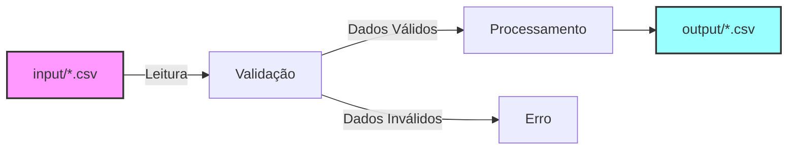
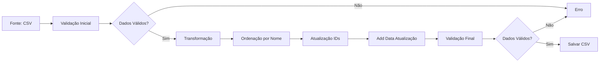

# Pipeline ETL com Data Quality

## Sobre o Projeto
Este projeto implementa uma pipeline ETL (Extract, Transform, Load) com validação de qualidade de dados, utilizando Python e DuckDB. O projeto foi desenvolvido para processar dados de palestrantes, aplicando transformações e validações de qualidade.

## Fluxo da Pipeline

### Fluxo de Dados


### Fluxo de Processamento


O processo é executado da seguinte forma:
1. **Entrada**: Lê os arquivos CSV da pasta `input/`
2. **Validação**: Verifica a qualidade dos dados
3. **Processamento**: Se os dados forem válidos, aplica as transformações
4. **Saída**: Salva os dados processados na pasta `output/`
   - Só salva se todas as validações passarem
   - Mantém o nome original do arquivo com sufixo `_processed`
   - Exemplo: `palestrantes.csv` → `palestrantes_processed.csv`


### Validações de Qualidade (Data Quality)
- Presença de colunas obrigatórias
  - id
  - name
  - country
  - is_botafoguense

- Ausência de valores nulos
- Tipos de dados corretos
- Validação de valores binários (0/1) para is_botafoguense

### Transformações
1. **Ordenação**: Registros ordenados alfabeticamente por nome
2. **ID Sequencial**: Geração de novos IDs sequenciais
3. **Data de Atualização**: Adição de timestamp de processamento
4. **Formatação**: Padronização da estrutura de saída

## Como Usar o projeto?

### Requisitos
- Python 3.8+
- DuckDB
- Pytest

### Instalação
1. Clone o repositório
2. Crie um ambiente virtual:
```bash
python -m venv venv
```

3. Ative o ambiente virtual:
```bash
# Windows
.\venv\Scripts\activate

# Linux/MacOS
source venv/bin/activate
```

4. Instale as dependências:
```bash
pip install -r requirements.txt
```

### Execução
Para executar a pipeline:
```bash
python src/etl_pipeline.py
```
